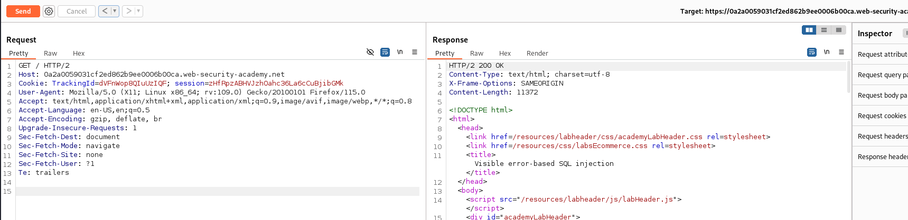
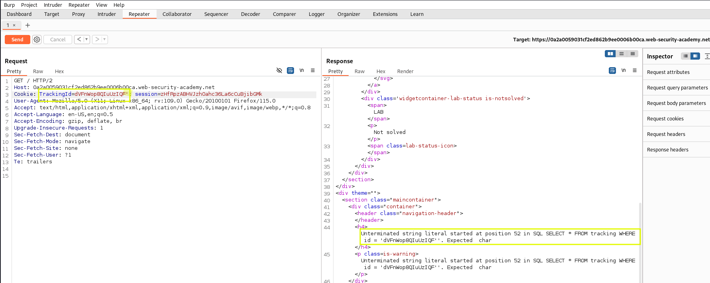
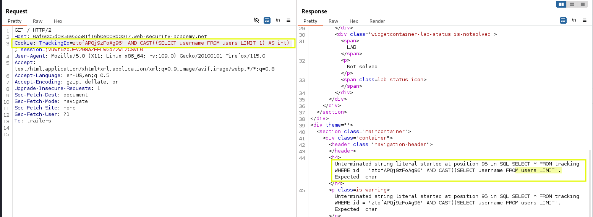
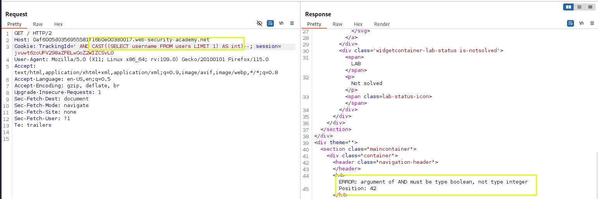
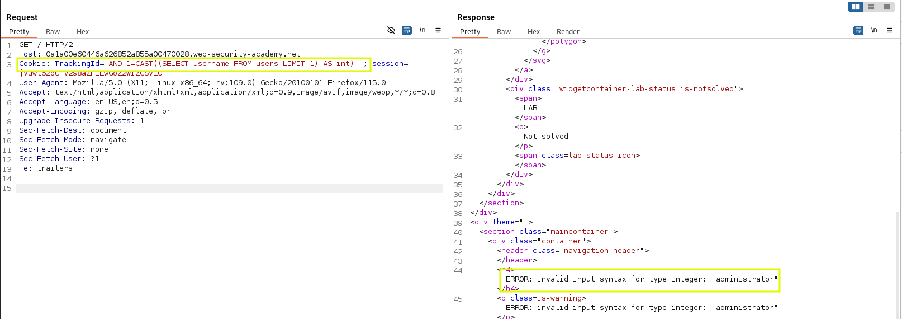
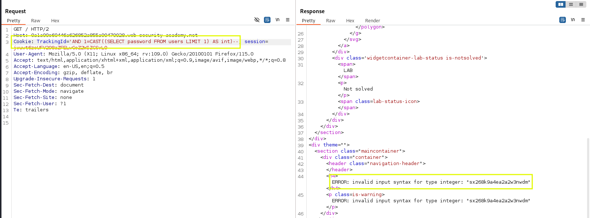
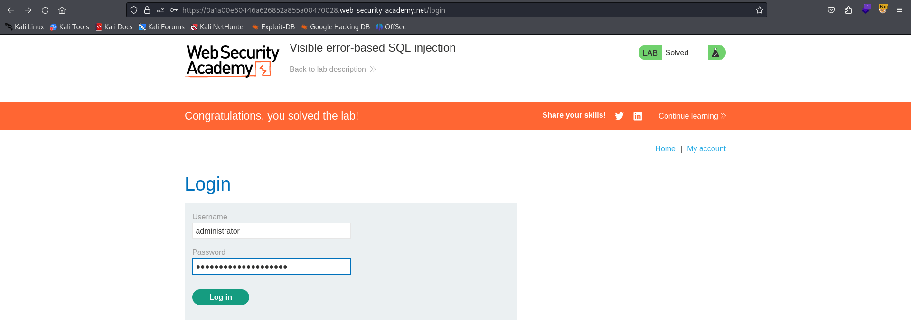

# Lab 10 SQL Injection - Port Swigger

## Statement

 This lab contains a SQL injection vulnerability. The application uses a tracking cookie for analytics, and performs a SQL query containing the value of the submitted cookie. The results of the SQL query are not returned.

The database contains a different table called users, with columns called username and password. To solve the lab, find a way to leak the password for the administrator user, then log in to their account. 

## Solution

The homepage is shown below:

Let's see the request via BurpSuite 

We see that there is a TrackingId value in the cookies, which might be used in a query like:

`SELECT TrackingId from Cookies WHERE TrackingId='1234'`

We can attempt to trigger a verbose error message by injecting a single quote into the TrackingId parameter to see how the query is constructed:

Now that we have the exact query sent to the database, we can attempt to trigger a data type mismatch error, which could reveal some data. By converting a string to an integer, we can cause this error, displaying the string we are trying to convert.

`CAST((SELECT username FROM users LIMIT 1) TO INT)`

The LIMIT 1 clause ensures that only the first username from the users table is selected. The CAST function attempts to convert this username to an integer, causing an error that reveals the string.

Initially, we encounter an error due to a character limit, which truncates the query output. To resolve this, we’ll simplify the query by ignoring the TrackingId.

Next, we run into another issue: after AND, the expression must evaluate to a boolean value.

Success! We see that the first username is administrator. Now, let's extract the corresponding password.

With both the username and password in hand, we can log in as the administrator.

Great job! The lab is complete.