# Lab 11 SQL Injection - Port Swigger

## Statement

 This lab contains a blind SQL injection vulnerability. The application uses a tracking cookie for analytics, and performs a SQL query containing the value of the submitted cookie.

The results of the SQL query are not returned, and the application does not respond any differently based on whether the query returns any rows or causes an error. However, since the query is executed synchronously, it is possible to trigger conditional time delays to infer information.

The database contains a different table called users, with columns called username and password. You need to exploit the blind SQL injection vulnerability to find out the password of the administrator user.

To solve the lab, log in as the administrator user. 

## Solution

The homepage looks like this:

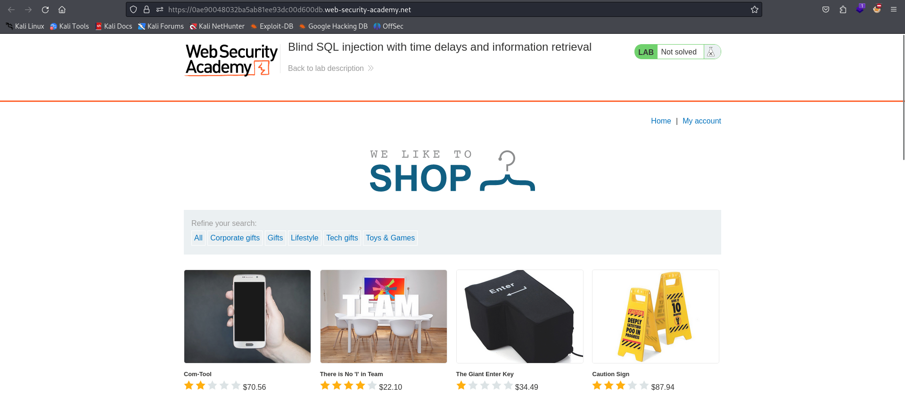

We know that the application doesn't respond differently when an error is caused. Therefore, we'll use conditional time delays to extract information. Initially, we need to determine the database type, which requires executing several queries. Eventually, we discover that the database is PostgreSQL.

To execute multiple queries in one go, we typically use a semicolon (;). However, adding it directly into the URL can be challenging because each query must be part of a parameter.

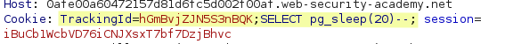

In the screenshot above, the query intended to trigger a time delay isn't executed. To work around this, we can replace the semicolon with %3b, which is URL-encoded for the semicolon. The server will recognize the full query, and the database will interpret %3b as a semicolon.

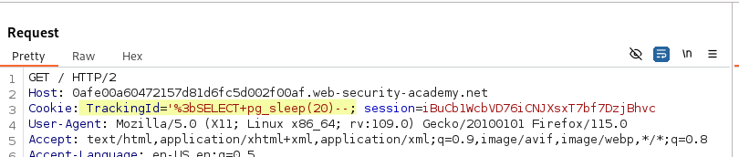

This modification successfully triggers a 20-second delay as expected. Now, we can cause a time delay based on a specific condition. The syntax for this in PostgreSQL is:

`SELECT case WHEN (condition) THEN pg_sleep(20) ELSE pg_sleep(0) END`

A 20-second delay occurs if the condition is true; otherwise, the delay is 0 seconds.

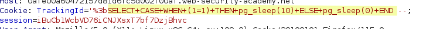

As shown, the response is received after 10 seconds, as intended. Next, let's check if an administrator user exists in the users table.

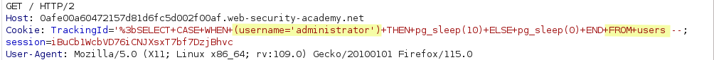

Since this condition is true, we can add another condition to retrieve information about the password. For instance, let's check if the password's length is 10 characters:

`LENGTH(password) = 10`

The LENGTH function returns the number of characters in the password. By testing different lengths, the correct length will cause a 10-second delay.

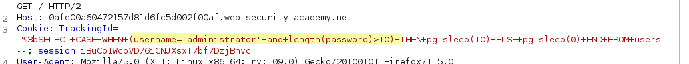

This condition triggers a delay, indicating that the password has more than 10 characters. Instead of manually testing all possible lengths, we can automate the process with a script.

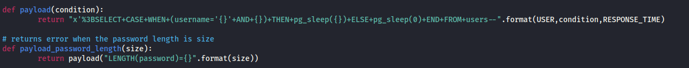

The first function generates the payload for the cookie that triggers time delays based on a condition. The constants RESPONSE_TIME and USER are predefined with values 10 and administrator, respectively.

The second function creates the condition that checks the length of the password, given an integer, and incorporates this condition into the payload string generated by the first function.

We can now create the findPasswordLength() function, which uses these previous functions to determine the password length.

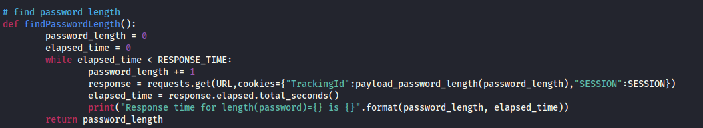

This function initially checks if the password is a single character by sending a request and measuring the elapsed time. If no time delay occurs, it checks for a password length of 2, and so on.

Determining the password length is only the first step. Next, we need to find the character at each position. To do this, we can use the following function:

`SUBSTRING(password, 4, 1) < 'm'`

This condition checks if the fourth character of the password is before 'm' in the ASCII table.

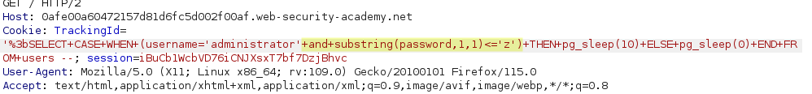

The response should be received after 10 seconds since the password characters are expected to be before 'z'. The query behaves as anticipated.

We can now identify the characters at each position using time delays. Let's add more functions to our script.

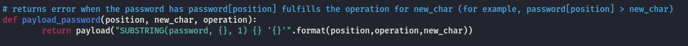

This function returns the payload needed to trigger a time delay by comparing new_char with the actual character at a given position. We can use this function to identify the character at a given position using binary search.

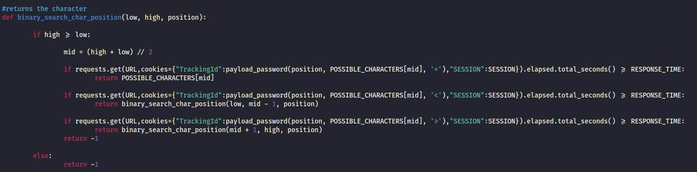

This function searches for the character at a specific position. The constant POSSIBLE_CHARACTERS must be ordered according to the ASCII table.

The function begins with the middle character of the possible characters list. If this character isn't the correct one (determined by the lack of a time delay), the function checks whether the real character is before or after it in the ASCII table. It then updates the list of possible characters and repeats the process.

When the correct character is found, the function returns it. The idea is to continue identifying characters at all positions.

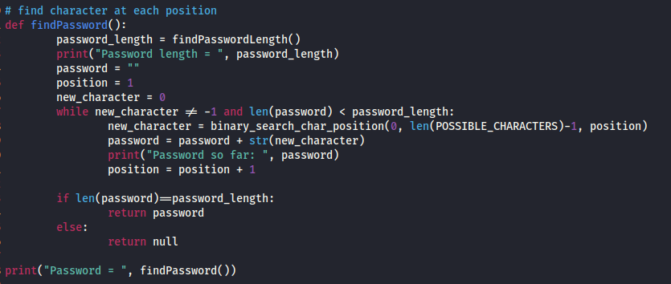

This function calls the binary search function for every position in the password. As each character is found, the password is updated until the full password length is reached.

When we execute this function in the terminal, the result is:

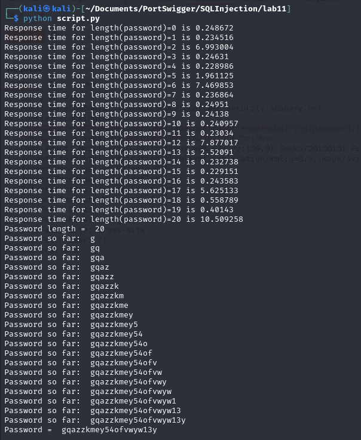

Finally, let's verify that the retrieved password is correct.

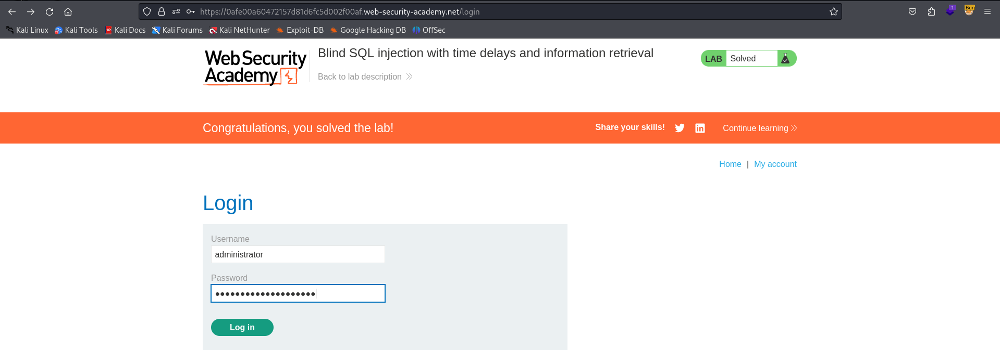

Great job!