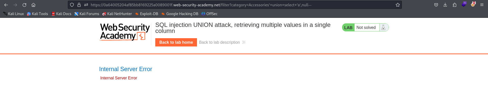

# Lab 6 SQL Injection - Port Swigger

## Statement
 This lab contains a SQL injection vulnerability in the product category filter. The results from the query are returned in the application's response so you can use a UNION attack to retrieve data from other tables.

The database contains a different table called users, with columns called username and password.

To solve the lab, perform a SQL injection UNION attack that retrieves all usernames and passwords, and use the information to log in as the administrator user. 

## Solution

Home page is 

Since we want to perform an SQL injection, we have to trigger some query, for example selecting some category. Now, we can obtain the number of columns in the products table:

No error implies 2 columns at least. If we try ordering the table by the third column we get an error. So there are 2 columns in products table.

We get an error if we try to show first column as a string:

But opposite result in the second column:

So far we have that there are 2 columns in products table and second column contains string data. Let's try a UNION attack, usernames from users table will be printed implementing the query:

`SELECT * FROM products WHERE category='Accesories' union select null,username from users`

We see that some usernames are shown, one of them is the administrator. Let's try to print its password in the same column. For doing it, we can use double-pipe sequence for string concatenation. The underscore ( _ ) character will be the separator between the username and its password.

`SELECT * FROM products WHERE category='Accesories' union select null,username  ||'_'|| password from users`

Great! We have the administrator's password. Now we can login as the administrator to solve the laboratory.

Well done! Great progress :)
