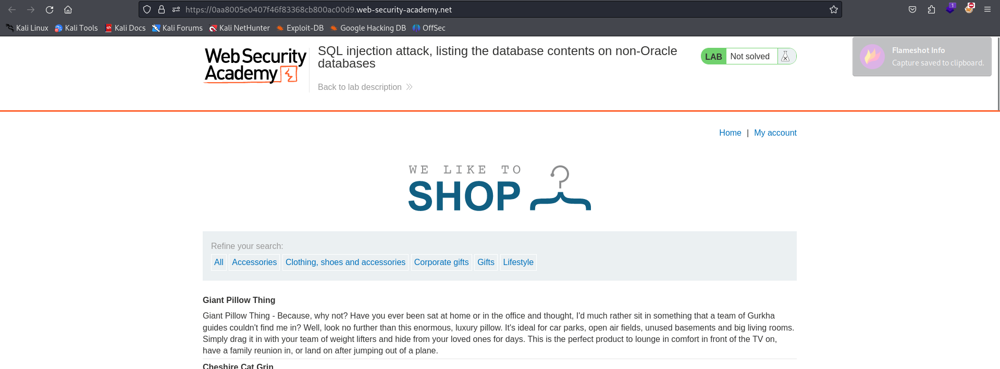

# Lab 7 SQL Injection - Port Swigger

## Statement
 This lab contains a SQL injection vulnerability in the product category filter. The results from the query are returned in the application's response so you can use a UNION attack to retrieve data from other tables.

The application has a login function, and the database contains a table that holds usernames and passwords. You need to determine the name of this table and the columns it contains, then retrieve the contents of the table to obtain the username and password of all users.

To solve the lab, log in as the administrator user. 
## Solution

Home page is 

In SQL, you can use the following query to obtain information about tables. This query returns four columns: TABLE_CATALOG, TABLE_SCHEMA, TABLE_NAME, and TABLE_TYPE:

`SELECT * FROM information_schema.tables`

We can use a UNION attack to print the version by leveraging the product category filter. First, we need to determine the number of columns in the products table. If there are at least two columns, the following query will not produce an error:

`SELECT * FROM products WHERE category="Pets" ORDER BY 2`

We can execute this query using the link:

Great! We now know that there are at least two columns. Let's check if there's a third column:

We get an error, so there are only two columns. Next, let's verify if both columns contain string data types.

Since there’s no error, we know that both columns contain strings. Now, we can inject a payload to print two string columns from information_schema.tables. Let's retrieve the table names and their types using the following query:

`SELECT * FROM products WHERE category="Pets" UNION SELECT TABLE_NAME, TABLE_TYPE FROM information_schema.tables`

Success! We have all the table names and their types. There’s a table that looks interesting called users_ovlunt. Let's find out its columns:

`SELECT * FROM products WHERE category="Pets" UNION SELECT COLUMN_NAME,NULL FROM information_schema.columns WHERE TABLE_NAME='users_ovlunt'`

We see that there's a column named username_obvktq and another called password_ldgkjx. Now, let’s print the rows from these columns:

`SELECT * FROM products WHERE category="Pets" UNION SELECT username_obvktq,password_ldgkjx FROM users_ovlunt`

We’ve found the administrator’s password! Now, we can log in as the administrator.

Great job!