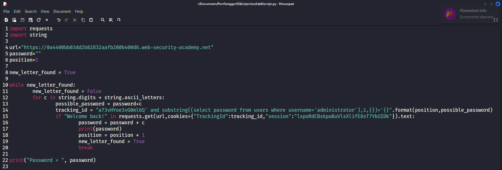

# Lab 8 SQL Injection - Port Swigger

## Statement

 This lab contains a blind SQL injection vulnerability. The application uses a tracking cookie for analytics, and performs a SQL query containing the value of the submitted cookie.

The results of the SQL query are not returned, and no error messages are displayed. But the application includes a "Welcome back" message in the page if the query returns any rows.

The database contains a different table called users, with columns called username and password. You need to exploit the blind SQL injection vulnerability to find out the password of the administrator user.

To solve the lab, log in as the administrator user. 

## Solution

The homepage is shown below:

We know that the application performs a SQL query using the value of a tracking cookie. Although the query may be vulnerable to SQL injection, the results are not displayed on the homepage.

However, the application includes a "Welcome back!" message if the query returns any rows. We can "ask" the application about the administrator's password and it "responds" with a yes (by showing the "Welcome back!" message) or no (by not showing it). The query being executed is likely something like:

`SELECT TrackingId FROM TrackedUsers WHERE TrackingId = 'u5YD3PapBcR4lN3e7Tj4'`

If this query returns a result, the "Welcome back!" message is displayed. Let’s see this in Burp Suite:

We can see that the TrackingId value identifies the user. If we forward the request, the page loads and the "Welcome back!" message appears:

To confirm that the message only appears when the query returns a result, we can modify the query to always be false:

`SELECT TrackingId FROM TrackedUsers WHERE TrackingId = 'u5YD3PapBcR4lN3e7Tj4' AND '1'='2'`

We'll change the TrackingId value using Burp Suite:

If we forward this request, the homepage loads without the "Welcome back!" message:

Great! Now we can start "asking" the application about the administrator's password. For example, we can check if the first character of the password is after 'm' in the ASCII table:

Since we don't see the "Welcome back!" message, the first character must be before 'm'. While we could manually try each possible character, this approach isn't efficient. Instead, we can write a Python script to automate the process of trying each character at each position until we find the correct password.

In Python, two libraries are particularly useful for this task: string and requests. The string library provides useful constants, such as string.digits, which contains all digits.

The requests library allows us to make HTTP requests. For example:

`requests.get("https://google.com", cookies={"TrackingId": "1234", "session": "ABCD"}`

Since we want to make many requests to the same URL with slight variations, we can implement a loop that changes the TrackingId value. We then check if the response contains the "Welcome back!" message. If it does, the modification was correct.

For example, to find the first character, the loop tries each possible character until one returns the "Welcome back!" message. Once we find the correct first character, we move on to the second, and so on. If none of the characters match, it means we've reached the end of the password.

Here’s the script. Remember to update the session and TrackingId values each time you load the page.

Note: This script isn't very efficient. We could improve it using a binary search technique, which we'll explore in future labs.

Let’s execute the script:

Success! We have retrieved the administrator's password. Let's log in as the administrator to complete the lab.

And we're done!

