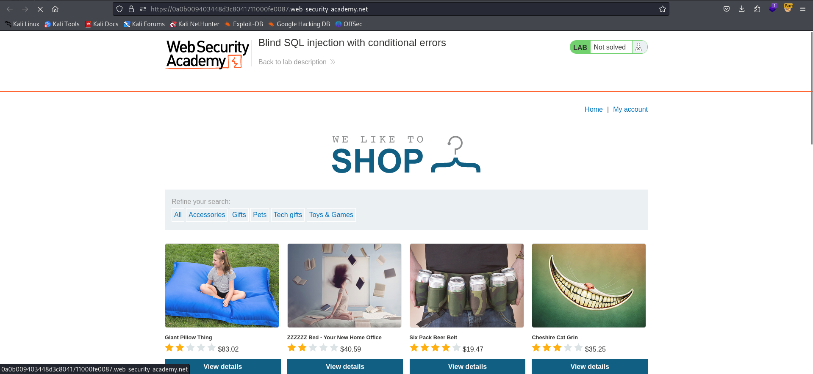
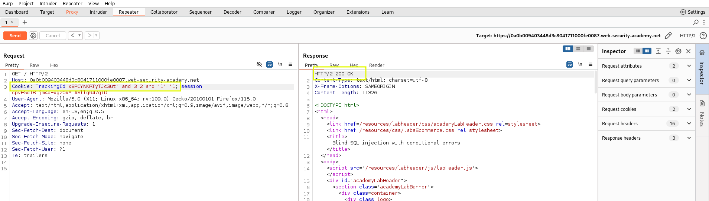
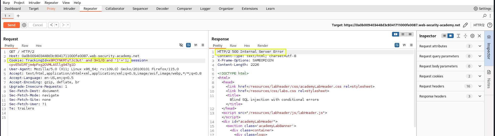
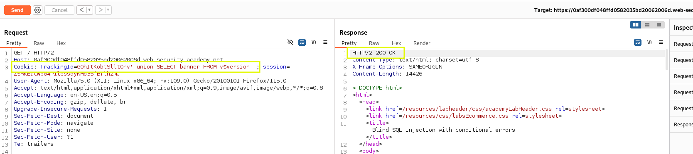
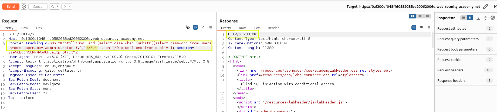
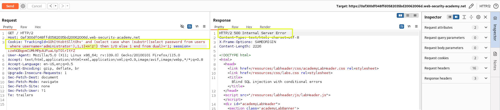
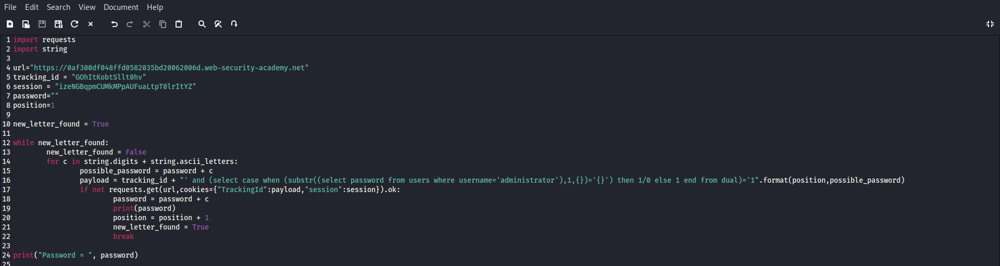
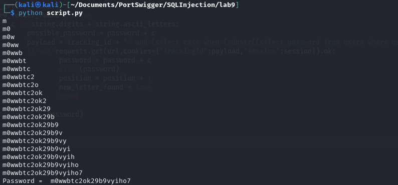
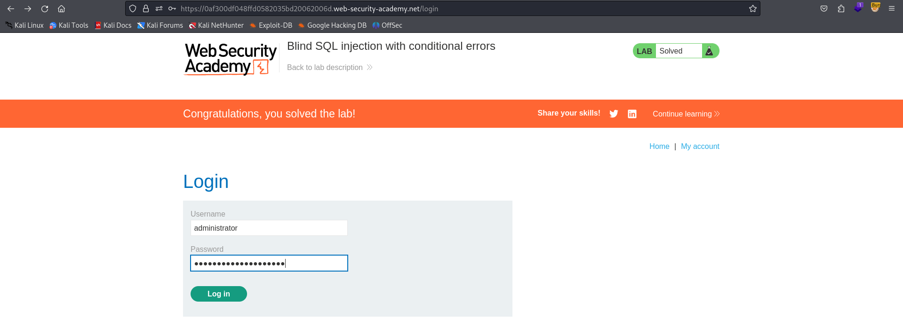

# Lab 9 SQL Injection - Port Swigger

## Statement

 This lab contains a blind SQL injection vulnerability. The application uses a tracking cookie for analytics, and performs a SQL query containing the value of the submitted cookie.

The results of the SQL query are not returned, and the application does not respond any differently based on whether the query returns any rows. If the SQL query causes an error, then the application returns a custom error message.

The database contains a different table called users, with columns called username and password. You need to exploit the blind SQL injection vulnerability to find out the password of the administrator user.

To solve the lab, log in as the administrator user. 

## Solution

The homepage is shown below:

In this case, we cannot rely on the HTML of the page to determine if the query returns any rows because the page doesn't change. Since errors aren't visible on the page, we need to inspect the server's response. Consider these examples:

    - `SELECT TrackingId FROM TrackedUsers WHERE TrackingId = '123' AND 1=2`
    - `SELECT TrackingId FROM TrackedUsers WHERE TrackingId = '123' AND 1/0=1`

In the first query, although no rows are returned, the query does not trigger any server errors since all values are valid. However, the second query triggers a server error because 1/0 is an invalid operation.

Let's test this in Burp Suite:

As shown in the second image, the server returns a 500 error when the invalid operation is performed.

The idea is to "ask" the database questions about the administrator's password. If the answer is "yes", the server returns an internal server error; if "no", it returns an OK status. We can achieve this by using the CASE expression in SQL. Depending on the query results, the CASE expression returns either a valid value or an invalid value that triggers a 500 error:

`SELECT TrackingId FROM TrackedUsers WHERE TrackingId = 'u5YD3PapBcR4lN3e7Tj4' AND (select case when (condition) then invalid_value else valid_value end from ual)=valid_value`

When the condition is true, the invalid_value is evaluated, triggering a server error. If the condition is false, the valid_value is processed without error.

Before proceeding, we need to confirm the database type. By testing some queries, we determine that the database is Oracle.

Note: The UNION attack works because the TrackedUsers table has only one column, and its data type matches the one in the query. You can refer to previous labs to see how to verify this.

Now, we can continue with the CASE expression. Our condition will check whether a specific character at a specific position in the administrator's password is greater than or equal to a certain value. For example, to check if the first letter of the password is after 'z' in the ASCII table:

It doesn't trigger an error, confirming that the first character is before 'z'. Now, let's check if it's before 'z':

Great, it works. Now we can script this process to try all possible characters at each position in the password.

The script is very similar to the one used in Lab 8. We'll start by trying all possible characters at the first position. When a character triggers an error, we save it and move to the second position, repeating the process.

Since we don't know the length of the password, we'll stop when no character triggers an error at a given position. Here’s the script:

Let's execute it:

Now that we have the password, let's log in to confirm:

Success! Great job!